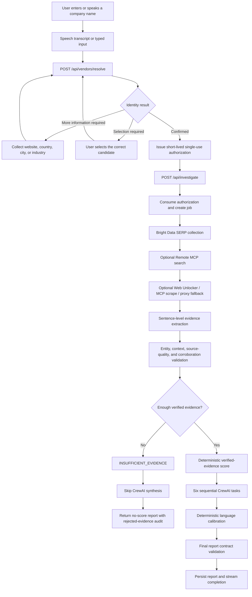
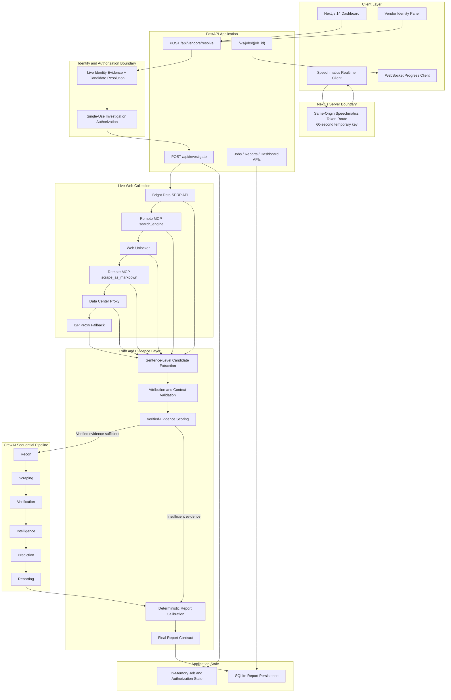
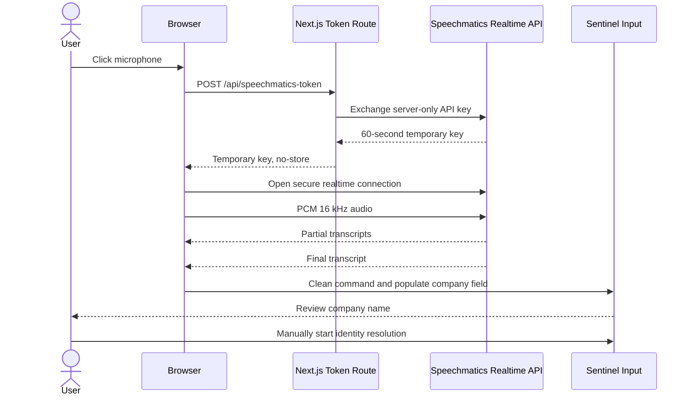

<div align="center">
<br />


🛡️ Sentinel Web-Risk Intelligence
Identity-First, Evidence-Grounded Vendor Risk Intelligence
Bright Data live-web collection · CrewAI orchestration · Speechmatics real-time voice input
<br />


<br />
> Sentinel does not score a company until its identity is confirmed and the collected claims survive attribution, context, source-quality, and corroboration checks.
<br />
Live Demo ·
API Documentation ·
Architecture ·
Testing ·
Documentation
<br />
</div>
---
Table of Contents
Overview
Problem and Design Response
Verified Capabilities
End-to-End Investigation Flow
System Architecture
Identity-First Investigation Gate
Evidence Validation and Risk Outcomes
AI Agent System
Bright Data Integration
Speechmatics Voice Input
Tech Stack
Quick Start
Environment Configuration
API Reference
Testing and Validation
Demo
Project Structure
Deployment
Technical Documentation
Known Limitations and Responsible Use
Hackathon Context
Contributing
License
---
🎯 Overview
Sentinel Web-Risk Intelligence is a full-stack responsible-AI and backend-engineering project for point-in-time third-party risk investigation.
The platform combines:
pre-investigation company identity resolution;
a short-lived, single-use authorization boundary;
live public-web collection through Bright Data providers;
sentence-level evidence attribution and false-positive controls;
deterministic risk scoring and language calibration;
six sequential CrewAI agents for evidence-grounded synthesis;
secure Speechmatics real-time voice transcription;
WebSocket progress updates and report persistence.
Sentinel is designed to make uncertainty visible. When the evidence is too sparse or unreliable, the backend returns `INSUFFICIENT_EVIDENCE` instead of silently treating missing information as low risk.
Intended Users
The current prototype is designed for technical evaluation and research by:
procurement and third-party risk teams;
compliance and business-continuity analysts;
responsible-AI and agentic-system researchers;
software engineering, AI, and data-science reviewers.
It is not a replacement for legal advice, regulated due diligence, audited financial analysis, or human decision-making.
---
🚨 Problem and Design Response
Third-party risk analysis is difficult because company names may be ambiguous, live-web results may refer to unrelated entities, and risk terminology often appears in prevention, guidance, speculation, or historical context rather than as a confirmed incident.
Sentinel addresses these failure modes through explicit engineering controls:
Failure Mode	Sentinel Control
Ambiguous company name	Identity resolution requests website, country, city, or industry context
Wrong company selected	Canonical identity and evidence URLs are confirmed before investigation
Replayed or mismatched request	Short-lived, single-use investigation authorization
Keyword appears in unrelated context	Sentence-level entity attribution and direct-claim checks
Preventive or hypothetical language	Negation, hypothetical, and protective-context rejection rules
Weak source creates a severe claim	Source-quality and corroboration thresholds
Missing public evidence appears “safe”	`INSUFFICIENT_EVIDENCE` no-score outcome
LLM wording contradicts the score	Deterministic report calibration and final contract validation
Provider output is unavailable	Optional-provider fallbacks and explicit telemetry
Long-lived speech key reaches browser	Server-only key exchange for a 60-second temporary token
---
✨ Verified Capabilities
Capability	Current Behaviour
Identity-first workflow	`/api/vendors/resolve` runs before `/api/investigate`
Three identity outcomes	`CONFIRMED`, `SELECTION_REQUIRED`, `MORE_INFORMATION_REQUIRED`
Confirmed-investigation gate	A confidence threshold and authenticated identity source are required
Single-use authorization	Opaque authorization expires and cannot be replayed
Live provider orchestration	SERP is the core provider; Remote MCP, Web Unlocker, Data Center proxy, and ISP proxy are controlled supplementary paths
Evidence-bound scoring	Only verified, source-linked evidence influences the score
False-attribution protection	Negated, hypothetical, protective, social-only, or weakly attributed claims can be rejected
Two valid report outcomes	`COMPLETED` with a score, or `INSUFFICIENT_EVIDENCE` without a defensible score
Conditional CrewAI execution	Six agents run only when the verified evidence supports scoring
Deterministic calibration	Score, level, trajectory, language, and citations must pass the final report contract
Evidence provenance	Provider, retrieval status, timestamp, character count, and SHA-256 digest can be recorded without storing raw scraped content in provenance
Secure voice input	Speechmatics temporary token, PCM audio worklet, partial/final transcripts, and manual review before investigation
Real-time progress	REST job creation plus WebSocket progress/completion events
Testing and CI	Unit/integration suite, Ruff critical checks, Bandit scan, coverage threshold, provider smoke tests, and controlled live validation
---
🔄 End-to-End Investigation Flow

```mermaid
flowchart TD
    A[User enters or speaks a company name] --> B[Speech transcript or typed input]
    B --> C[POST /api/vendors/resolve]
    C --> D{Identity result}

    D -->|More information required| E[Collect website, country, city, or industry]
    E --> C

    D -->|Selection required| F[User selects the correct candidate]
    F --> C

    D -->|Confirmed| G[Issue short-lived single-use authorization]
    G --> H[POST /api/investigate]
    H --> I[Consume authorization and create job]

    I --> J[Bright Data SERP collection]
    J --> K[Optional Remote MCP search]
    K --> L[Optional Web Unlocker / MCP scrape / proxy fallback]
    L --> M[Sentence-level evidence extraction]
    M --> N[Entity, context, source-quality, and corroboration validation]
    N --> O{Enough verified evidence?}

    O -->|No| P[INSUFFICIENT_EVIDENCE]
    P --> Q[Skip CrewAI synthesis]
    Q --> R[Return no-score report with rejected-evidence audit]

    O -->|Yes| S[Deterministic verified-evidence score]
    S --> T[Six sequential CrewAI tasks]
    T --> U[Deterministic language calibration]
    U --> V[Final report contract validation]
    V --> W[Persist report and stream completion]
```
---
🏗️ System Architecture

```mermaid
graph TB
    subgraph CLIENT["Client Layer"]
        UI["Next.js 14 Dashboard"]
        VOICE["Speechmatics Realtime Client"]
        IDP["Vendor Identity Panel"]
        WS["WebSocket Progress Client"]
    end

    subgraph FRONTEND_SERVER["Next.js Server Boundary"]
        TOKEN["Same-Origin Speechmatics Token Route<br/>60-second temporary key"]
    end

    subgraph API["FastAPI Application"]
        RESOLVE["POST /api/vendors/resolve"]
        INVESTIGATE["POST /api/investigate"]
        JOBS["Jobs / Reports / Dashboard APIs"]
        SOCKET["/ws/jobs/{job_id}"]
    end

    subgraph TRUST["Identity and Authorization Boundary"]
        IDENTITY["Live Identity Evidence + Candidate Resolution"]
        AUTH["Single-Use Investigation Authorization"]
    end

    subgraph COLLECTION["Live Web Collection"]
        SERP["Bright Data SERP API"]
        MCP_SEARCH["Remote MCP search_engine"]
        UNLOCKER["Web Unlocker"]
        MCP_SCRAPE["Remote MCP scrape_as_markdown"]
        DC["Data Center Proxy"]
        ISP["ISP Proxy Fallback"]
    end

    subgraph EVIDENCE["Truth and Evidence Layer"]
        EXTRACT["Sentence-Level Candidate Extraction"]
        VERIFY["Attribution and Context Validation"]
        SCORE["Verified-Evidence Scoring"]
        CALIBRATE["Deterministic Report Calibration"]
        CONTRACT["Final Report Contract"]
    end

    subgraph AGENTS["CrewAI Sequential Pipeline"]
        A1["Recon"]
        A2["Scraping"]
        A3["Verification"]
        A4["Intelligence"]
        A5["Prediction"]
        A6["Reporting"]
        A1 --> A2 --> A3 --> A4 --> A5 --> A6
    end

    subgraph STORAGE["Application State"]
        MEMORY["In-Memory Job and Authorization State"]
        SQLITE["SQLite Report Persistence"]
    end

    UI --> RESOLVE
    IDP --> RESOLVE
    VOICE --> TOKEN
    TOKEN --> VOICE
    RESOLVE --> IDENTITY
    IDENTITY --> AUTH
    AUTH --> INVESTIGATE
    INVESTIGATE --> SERP
    SERP --> MCP_SEARCH
    MCP_SEARCH --> UNLOCKER
    UNLOCKER --> MCP_SCRAPE
    MCP_SCRAPE --> DC
    DC --> ISP
    SERP & MCP_SEARCH & UNLOCKER & MCP_SCRAPE & DC & ISP --> EXTRACT
    EXTRACT --> VERIFY
    VERIFY --> SCORE
    SCORE -->|Verified evidence sufficient| A1
    SCORE -->|Insufficient evidence| CALIBRATE
    A6 --> CALIBRATE
    CALIBRATE --> CONTRACT
    CONTRACT --> SQLITE
    INVESTIGATE --> MEMORY
    JOBS --> SQLITE
    SOCKET --> WS
```
Architectural Principles
Identity before risk: risk scoring cannot begin until a company is strongly confirmed.
Evidence before synthesis: LLM tasks receive accepted evidence rather than a flattened raw text pool.
No-score is a valid outcome: insufficient evidence is not converted into a low-risk conclusion.
Deterministic authority: the LLM supports explanation; deterministic code owns score, level, trajectory, citation, and report-contract authority.
Auditable provider boundaries: used providers, accepted/rejected evidence, and provenance are recorded separately.
Point-in-time assessment: the current implementation does not claim continuous surveillance.
A deeper component-level description is available in `docs/ARCHITECTURE.md`.
---
🪪 Identity-First Investigation Gate
The investigation is a two-step API flow.
Step 1 — Resolve the Vendor
```http
POST /api/vendors/resolve
Content-Type: application/json
```
```json
{
  "vendor_name": "Microsoft",
  "website": "https://www.microsoft.com",
  "country": "United States",
  "industry": "Technology",
  "language": "EN"
}
```
Possible responses:
Status	Meaning
`CONFIRMED`	One company identity passed the confidence and source-quality controls
`SELECTION_REQUIRED`	Multiple plausible companies were found
`MORE_INFORMATION_REQUIRED`	The name is too generic or evidence is too weak
A confirmed result returns an opaque authorization object:
```json
{
  "authorization_id": "short-lived-opaque-value",
  "expires_at": "ISO-8601 timestamp",
  "single_use": true,
  "required_for": "/api/investigate"
}
```
Step 2 — Start the Authorized Investigation
```http
POST /api/investigate
Content-Type: application/json
```
```json
{
  "vendor_name": "Microsoft",
  "identity_authorization_id": "short-lived-opaque-value",
  "language": "EN"
}
```
The authorization is consumed before a job is created. Invalid, expired, replayed, unconfirmed, or vendor-mismatched authorizations are rejected.
---
🧾 Evidence Validation and Risk Outcomes
Sentence-Level Validation
Each candidate record retains:
company identity;
category and severity;
exact evidence excerpt;
source URL, title, provider, and quality;
publication date when available;
entity-match result;
direct-claim result;
negation, hypothetical, and protective-context flags;
corroboration count and independent domains;
verification decision and rejection reason.
Source-Quality Classes
The current rules distinguish:
`AUTHORITATIVE`
`COMPANY_OWNED`
`REPUTABLE_NEWS`
`SPECIALIST`
`GENERAL_WEB`
`SOCIAL`
`UNKNOWN`
Report Outcomes
`COMPLETED`
Returned when verified evidence is sufficient for a defensible score.
`risk_score_available: true`
score and level are validated together;
at least one verified citation is mandatory;
CrewAI may run over the accepted evidence;
final language and citations must pass the report contract.
`INSUFFICIENT_EVIDENCE`
Returned when live retrieval completes but the verified evidence does not support a defensible score.
`risk_score_available: false`
missing evidence is not interpreted as low risk;
rejected sources are not promoted into the final citation set;
CrewAI synthesis is skipped;
the report explains the evidence gap and recommended next steps.
Compatibility fields may contain neutral placeholders for existing clients. Any consumer must check `risk_score_available` and `evidence_assessment_status` before interpreting `risk_score`, `risk_level`, or `disruption_probability`.
See `docs/EVIDENCE_GOVERNANCE.md` for the complete decision model.
---
🤖 AI Agent System
When verified evidence is sufficient, Sentinel runs six sequential CrewAI roles:
Agent	Responsibility
Recon Agent	Reviews accepted live-search evidence and preserves source links
Scraping Agent	Reviews accepted supplementary evidence from permitted public sources
Verification Agent	Assesses credibility, recency, relevance, entity match, and contradictions
Intelligence Agent	Synthesizes the verified cross-category risk profile
Prediction Agent	Produces a calibrated disruption estimate and time horizon
Reporting Agent	Returns a structured executive JSON draft
The agents do not own the final score. Deterministic code controls the risk score, level, disruption calculation, calibrated wording, citations, and final report contract.
If verified evidence is insufficient, the agent pipeline is skipped to reduce hallucination risk and unnecessary LLM cost.
---
🌐 Bright Data Integration
Sentinel treats direct SERP retrieval as the core live provider and uses other Bright Data services as controlled supplementary paths.
Provider	Role	Behaviour
SERP API	Targeted live-web search	Core provider for a controlled live investigation
Remote MCP `search_engine`	Supplementary agent-native search	Unique results are merged and normalized
Web Unlocker	Access to complex permitted public pages	Optional; unusable or error bodies are rejected
Remote MCP `scrape_as_markdown`	Supplementary page extraction	Used as a fallback when appropriate
Data Center Proxy	Optional direct public-page request	Failure is isolated and recorded
ISP Proxy	Optional fallback after Data Center failure	Runs only when configured and required
Provider availability depends on account configuration, target-page policy, network conditions, robots restrictions, and regional access. A provider may be configured but return no usable evidence in a particular run.
---
🎙️ Speechmatics Voice Input
The frontend uses the official `@speechmatics/real-time-client` package and does not expose the long-lived Speechmatics credential to the browser.

```mermaid
sequenceDiagram
    actor User
    participant Browser
    participant Next as Next.js Token Route
    participant SM as Speechmatics Realtime API
    participant UI as Sentinel Input

    User->>Browser: Click microphone
    Browser->>Next: POST /api/speechmatics-token
    Next->>SM: Exchange server-only API key
    SM-->>Next: 60-second temporary key
    Next-->>Browser: Temporary key, no-store
    Browser->>SM: Open secure realtime connection
    Browser->>SM: PCM 16 kHz audio
    SM-->>Browser: Partial transcripts
    SM-->>Browser: Final transcript
    Browser->>UI: Clean command and populate company field
    UI-->>User: Review company name
    User->>UI: Manually start identity resolution
```
Security and usability controls:
same-origin token requests;
server-only `SPEECHMATICS_API_KEY`;
60-second temporary authorization;
no browser-exposed `NEXT_PUBLIC_SPEECHMATICS_API_KEY`;
PCM audio worklet and microphone cleanup;
partial and final transcript handling;
automatic removal of command prefixes such as “scan” or “investigate”;
no automatic risk investigation after transcription;
supported UI language mapping for English, Mandarin Chinese, Arabic, Bangla, German, and Japanese.
---
🛠️ Tech Stack
Backend
Technology	Current Repository Configuration	Purpose
Python	3.11+	Backend and test runtime
FastAPI	0.115.0	REST API and WebSocket gateway
Uvicorn	0.31.1	ASGI runtime
CrewAI	`>=0.80.0`	Sequential multi-agent orchestration
OpenAI SDK	1.51.0	OpenAI-compatible LLM transport
LangChain	`>=0.2.16,<0.3.0`	LLM integration utilities
HTTPX	0.27.2	Async provider calls
Pydantic	`>=2.7,<3`	Request and configuration validation
Beautiful Soup / lxml	4.12.3 / 5.3.0	Response parsing
SQLite	Built in	Report persistence
Pytest / Ruff / Bandit	Development dependencies	Tests, critical lint checks, and security scanning
Frontend
Technology	Current Repository Configuration	Purpose
Next.js	`^14.2.0`	App Router frontend and token endpoint
React	`^18.3.0`	User interface
TypeScript	`^5.4.0`	Typed frontend logic
Tailwind CSS	`^3.4.19`	Styling
Recharts	`^2.12.0`	Visualisation
Framer Motion	`^11.3.0`	Motion and transitions
Speechmatics Client	`8.5.1`	Secure real-time transcription
---
🚀 Quick Start
Prerequisites
```bash
python --version    # 3.11+
node --version      # 20+
npm --version       # 10+
docker --version    # Optional
```
1. Clone the Repository
```bash
git clone https://github.com/Jxxy123/sentinel-web-risk-intelligence.git
cd sentinel-web-risk-intelligence
```
2. Start the Backend
```bash
cd backend

python -m venv .venv
```
Activate the environment:
```bash
# macOS / Linux
source .venv/bin/activate

# Windows PowerShell
.venv\Scripts\Activate.ps1
```
Install dependencies and create the environment file:
```bash
pip install -r requirements.txt
cp .env.example .env
```
Set the required credentials in `backend/.env`, then start FastAPI:
```bash
python main.py
```
Local endpoints:
API: `http://localhost:8000`
Swagger UI: `http://localhost:8000/docs`
Health: `http://localhost:8000/health`
3. Start the Frontend
Open a second terminal:
```bash
cd frontend
npm install
cp .env.example .env.local
```
Configure:
```env
NEXT_PUBLIC_API_URL=http://localhost:8000
NEXT_PUBLIC_WS_URL=ws://localhost:8000
SPEECHMATICS_API_KEY=your_server_only_speechmatics_key
```
Then run:
```bash
npm run dev
```
Open `http://localhost:3000`.
4. Run an Investigation
Enter or speak a company name.
Review the transcript before continuing.
Resolve the company identity.
Provide website, country, city, or industry if more context is requested.
Select the correct candidate when multiple matches are returned.
Start the authorized investigation.
Observe live progress through the WebSocket-powered interface.
Review the score only when `risk_score_available` is true.
---
⚙️ Environment Configuration
Backend: Required for Real Provider Mode
```env
APP_ENV=development
APP_HOST=0.0.0.0
APP_PORT=8000
CORS_ORIGINS=http://localhost:3000
EXECUTION_MODE=real

OPENAI_API_KEY=
OPENAI_BASE_URL=https://api.aimlapi.com/v1
FREE_TIER_MODEL=meta-llama/Llama-3.3-70B-Instruct-Turbo

BRIGHT_DATA_API_KEY=
BRIGHT_DATA_SERP_ZONE=
BRIGHT_DATA_SERP_API_URL=https://api.brightdata.com/request

SECRET_KEY=replace-with-a-secure-random-secret
DATABASE_URL=sqlite:///./sentinel.db
```
Backend: Optional Supplementary Providers
```env
BRIGHT_DATA_WEB_UNLOCKER_ZONE=
BRIGHT_DATA_WEB_UNLOCKER_URL=https://api.brightdata.com/request

BRIGHT_DATA_MCP_BASE_URL=https://mcp.brightdata.com/mcp
BRIGHT_DATA_MCP_TOOLS=search_engine,scrape_as_markdown
BRIGHT_DATA_MCP_GROUPS=
BRIGHT_DATA_MCP_UNLOCKER_ZONE=
BRIGHT_DATA_MCP_PRO=false

BRIGHT_DATA_PROXY_HOST=brd.superproxy.io
BRIGHT_DATA_PROXY_PORT=33335
BRIGHT_DATA_PROXY_USER=
BRIGHT_DATA_PROXY_PASS=
BRIGHT_DATA_ISP_PROXY_USER=
BRIGHT_DATA_ISP_PROXY_PASS=
BRIGHT_DATA_ZONE=data_center

DATA_CENTER_PROXY=
ISP_PROXY=
```
Deterministic Mock Mode
```env
EXECUTION_MODE=mock
```
Mock mode is intended for deterministic development and automated tests. It avoids external provider calls.
Frontend
```env
NEXT_PUBLIC_API_URL=http://localhost:8000
NEXT_PUBLIC_WS_URL=ws://localhost:8000

# Server-only. Never prefix this with NEXT_PUBLIC_.
SPEECHMATICS_API_KEY=
```
Never commit `.env`, `.env.local`, provider passwords, temporary tokens, or generated authenticated MCP URLs.
A complete environment and deployment guide is available in `docs/DEPLOYMENT_AND_OPERATIONS.md`.
---
📡 API Reference
Interactive OpenAPI documentation is available at `/docs`.
Core Endpoints
Method	Endpoint	Description
`GET`	`/health`	Service status and version
`POST`	`/api/vendors/resolve`	Resolve and confirm vendor identity
`POST`	`/api/investigate`	Consume a confirmed identity authorization and create a job
`GET`	`/api/jobs/{job_id}`	Return the current job state
`GET`	`/api/reports`	List recent reports
`GET`	`/api/reports/{report_id}`	Return one report
`DELETE`	`/api/reports/{report_id}`	Delete one report
`GET`	`/api/dashboard/stats`	Return dashboard aggregates
`WS`	`/ws/jobs/{job_id}`	Stream status, progress, completion, or failure
Job Response
```json
{
  "job_id": "generated-uuid",
  "status": "queued",
  "vendor_name": "Microsoft"
}
```
Report Contract: Key Fields
```typescript
type EvidenceAssessmentStatus =
  | "COMPLETED"
  | "INSUFFICIENT_EVIDENCE";

interface RiskReport {
  vendor_name: string;
  evidence_assessment_status: EvidenceAssessmentStatus;
  risk_score_available: boolean;

  // Interpret only when risk_score_available === true.
  risk_score: number;
  risk_level: "LOW" | "MEDIUM" | "HIGH" | "CRITICAL";
  disruption_probability: number;

  confidence_score: number;
  executive_summary: string;
  risk_headline: string;
  primary_risk_category: string;
  key_findings: string[];
  risk_trajectory: string;
  recommended_actions: string[];
  monitoring_signals: string[];
  time_horizon: string;
  signals: RiskSignal[];
  sources: {
    url: string;
    title: string;
    source: string;
  }[];
  evidence_provenance: EvidenceProvenanceRecord[];
  raw_intelligence: Record<string, unknown>;
  status: "completed";
  generated_at: string;
}
```
---
📊 Risk Scoring Model
Sentinel scores only records that pass the evidence validator.
Severity Base Weights
Severity	Base Weight
Critical	35
High	20
Medium	10
Low	3
The final contribution of an accepted indicator is adjusted by:
source-quality multiplier;
publication freshness;
independent corroboration;
duplicate-indicator suppression.
Score Bands
Score	Level
0–24	LOW
25–49	MEDIUM
50–69	HIGH
70–100	CRITICAL
A numeric score is produced only when the evidence sufficiency rule is met. The model does not interpret an empty public-web result set as a low-risk finding.
---
✅ Testing and Validation
The hardening branch has completed:
216 passing backend tests
0 failing backend tests
8 non-blocking deprecation warnings
100% measured coverage for `core/risk_engine.py`
90% enforced minimum for that measured module
Ruff critical Python checks
Bandit medium/high-confidence security scan
focused identity, authorization, provider, evidence, calibration, report-contract, and orchestration tests
a successful controlled live Microsoft investigation
Latest Controlled Live Validation
Date: 31 July 2026
Metric	Result
Workflow	Controlled Full Live Investigation
Outcome	`COMPLETED`
Risk result	4/100 (`LOW`)
Confidence	0.46
Disruption probability	0.05
Unique live-search results	29
Verified final sources	1
Usable providers	SERP API, Remote MCP `search_engine`, Remote MCP `scrape_as_markdown`
Optional providers without usable output	Proxy Network, Web Unlocker
Database writes in smoke test	0
Workflow result	Passed
This is a point-in-time engineering validation of the end-to-end pipeline, not a benchmark of universal company coverage or predictive accuracy.
Run the backend suite locally:
```bash
cd backend
pip install -r requirements-dev.txt
python -m pytest tests -v \
  --cov=core.risk_engine \
  --cov-report=term-missing \
  --cov-fail-under=90
```
Further details are in `docs/TESTING_AND_VALIDATION.md`.
---
🎥 Demo
Live frontend: sentinel-web-risk-intelligence.vercel.app
Backend API documentation: Render Swagger UI
Demo video: Sentinel Web-Risk Hackathon Walkthrough
Suggested historical demonstration targets:
Vendor	Typical Public Evidence
Evergrande	Debt, restructuring, and regulatory reporting
FTX	Legal, financial, and reputational evidence
Silicon Valley Bank	Financial and operational disruption evidence
Lehman Brothers	Archived financial-collapse reporting
Theranos	Legal and reputational evidence
Historical targets are useful for UI demonstrations, but results still depend on current retrieval, identity confirmation, and evidence validation.
---
📁 Project Structure
```text
sentinel-web-risk-intelligence/
├── .github/
│   └── workflows/
│       ├── backend-tests.yml
│       ├── full-live-investigation.yml
│       ├── vendor-identity-live-smoke.yml
│       ├── vendor-identity-runtime-smoke.yml
│       ├── confirmed-investigation-live-smoke.yml
│       ├── crewai-live-smoke.yml
│       └── brightdata-*-smoke.yml
│
├── backend/
│   ├── main.py
│   ├── requirements.txt
│   ├── requirements-dev.txt
│   ├── Dockerfile
│   ├── .env.example
│   │
│   ├── agents/
│   │   └── orchestrator.py
│   │
│   ├── core/
│   │   ├── brightdata.py
│   │   ├── brightdata_remote_mcp.py
│   │   ├── company_identity.py
│   │   ├── config.py
│   │   ├── database.py
│   │   ├── evidence_scoring.py
│   │   ├── evidence_validation.py
│   │   ├── industry_profiles.py
│   │   ├── investigation_authorization.py
│   │   ├── live_vendor_identity.py
│   │   ├── mock_providers.py
│   │   ├── orchestrator_truth.py
│   │   ├── provider_factory.py
│   │   ├── report_calibration.py
│   │   ├── report_contract.py
│   │   ├── risk_engine.py
│   │   ├── serp_parser.py
│   │   ├── vendor_resolution.py
│   │   └── vendor_resolution_api.py
│   │
│   ├── tests/
│   │   ├── test_company_identity.py
│   │   ├── test_confirmed_investigation_gate.py
│   │   ├── test_evidence_scoring.py
│   │   ├── test_evidence_validation.py
│   │   ├── test_orchestrator_integration.py
│   │   ├── test_report_calibration.py
│   │   ├── test_report_contract.py
│   │   ├── test_report_outcomes.py
│   │   ├── test_truth_hardening_regression.py
│   │   └── ...
│   │
│   └── tools/
│       ├── full_live_investigation_smoke_test.py
│       ├── vendor_identity_live_smoke_test.py
│       ├── confirmed_investigation_live_smoke_test.py
│       └── brightdata_*_smoke_test.py
│
├── frontend/
│   ├── .env.example
│   ├── package.json
│   ├── Dockerfile
│   ├── public/
│   │   └── speechmatics-pcm-worklet.js
│   └── src/
│       ├── app/
│       │   ├── api/speechmatics-token/route.ts
│       │   ├── layout.tsx
│       │   └── page.tsx
│       ├── components/dashboard/
│       │   ├── VendorIdentityPanel.tsx
│       │   ├── AgentStatusPanel.tsx
│       │   ├── RiskReportCard.tsx
│       │   └── ...
│       └── lib/
│           ├── api.ts
│           └── useSpeechmaticsVoice.ts
│
├── docs/
│   ├── ARCHITECTURE.md
│   ├── EVIDENCE_GOVERNANCE.md
│   ├── TESTING_AND_VALIDATION.md
│   └── DEPLOYMENT_AND_OPERATIONS.md
│
├── docker-compose.yml
├── LICENSE
└── README.md
```
---
🚢 Deployment
The current deployment model uses:
Render for the FastAPI backend;
Vercel for the Next.js frontend.
Backend — Render
Recommended configuration:
Setting	Value
Root directory	`backend`
Runtime	Python 3
Build command	`pip install -r requirements.txt`
Start command	`python main.py`
Set backend credentials and provider variables in Render. Never place provider secrets in Vercel public variables.
Frontend — Vercel
Variable	Purpose
`NEXT_PUBLIC_API_URL`	Public HTTPS Render backend URL
`NEXT_PUBLIC_WS_URL`	Public WSS backend URL
`SPEECHMATICS_API_KEY`	Server-only Vercel environment variable
Set the backend `CORS_ORIGINS` to the exact production and required preview origins, then redeploy the backend before redeploying the frontend.
The complete order of operations, health checks, secret placement, and troubleshooting guidance is in `docs/DEPLOYMENT_AND_OPERATIONS.md`.
---
📚 Technical Documentation
Document	Purpose
`docs/ARCHITECTURE.md`	Components, trust boundaries, request flow, state, and provider orchestration
`docs/EVIDENCE_GOVERNANCE.md`	Identity, attribution, evidence sufficiency, scoring authority, provenance, and LLM boundaries
`docs/TESTING_AND_VALIDATION.md`	Unit, integration, security, provider, and controlled live-validation strategy
`docs/DEPLOYMENT_AND_OPERATIONS.md`	Local setup, Render/Vercel deployment, secrets, CORS, health checks, and troubleshooting
---
⚠️ Known Limitations and Responsible Use
Sentinel produces a point-in-time public-web assessment, not continuous surveillance.
Public-web coverage can be incomplete, delayed, duplicated, regionally restricted, or unavailable.
Provider success varies by page, product access, network conditions, and target policy.
Source-quality classification is currently rule-based and should be treated as a screening control, not an infallible authority judgement.
Domain suffix alone does not prove that a page is an authoritative source for the company or event being assessed.
The current authorization store and active-job state are process-local and should be moved to a durable shared store before horizontal production scaling.
SQLite is appropriate for the prototype but not a complete enterprise persistence strategy.
Client applications must check `risk_score_available`; compatibility placeholders must not be shown as an actual low-risk judgement.
LLM-generated language can still require review even though deterministic calibration and contract checks restrict the accepted final report.
Risk estimates are not audited financial forecasts and should not be used as the sole basis for procurement, legal, compliance, lending, investment, or safety-critical decisions.
The successful Microsoft live run validates the engineering pipeline, not universal predictive accuracy.
---
🏆 Hackathon Context
Sentinel was originally developed for the lablab.ai × Bright Data Web Data UNLOCKED Hackathon 2026 and has since been extended with identity-first authorization, truth-safe evidence scoring, secure Speechmatics voice input, and a broader automated-validation framework.
Demonstrated Engineering Areas
Bright Data SERP, Remote MCP, Web Unlocker, and proxy integrations;
FastAPI REST and WebSocket services;
CrewAI orchestration with configurable OpenAI-compatible LLM transport;
secure client/server Speechmatics design;
evidence provenance and report-contract validation;
deterministic mock mode and controlled real-provider validation;
CI workflows for tests, security checks, and provider smoke tests.
---
🤝 Contributing
Fork the repository.
Create a focused branch:
```bash
git checkout -b feature/your-feature
```
Install development dependencies:
```bash
cd backend
pip install -r requirements-dev.txt
```
Run the backend checks:
```bash
ruff check . --select E9,F63,F7,F82
bandit -r core agents main.py -ll -ii --skip B104
python -m pytest tests -v \
  --cov=core.risk_engine \
  --cov-report=term-missing \
  --cov-fail-under=90
```
Build the frontend:
```bash
cd ../frontend
npm install
npm run build
```
Commit, push, and open a pull request with:
the problem being solved;
the files changed;
test evidence;
security or provider implications;
documentation updates.
Do not include `.env` files, API keys, proxy credentials, temporary tokens, live report artifacts containing sensitive data, or authenticated MCP URLs.
---
📄 License
This project is licensed under the MIT License. See `LICENSE`.
Copyright (c) 2026 Jxxy123
---
<div align="center">
<br />
Sentinel Web-Risk Intelligence
Confirm identity. Validate evidence. Calibrate uncertainty.
<br />

 

 

<br />
</div>
