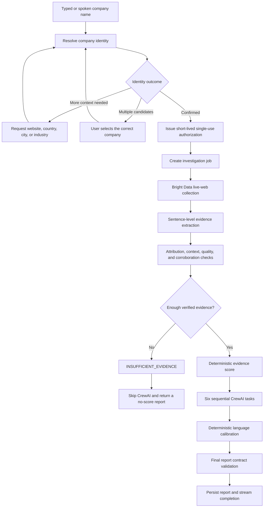
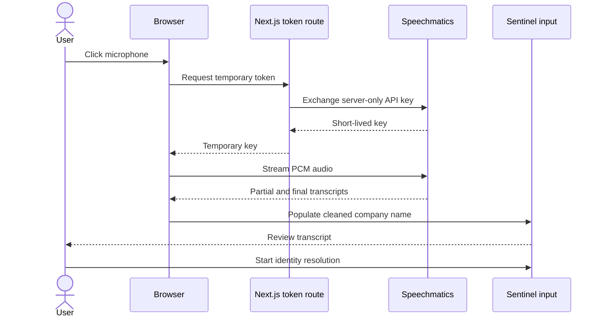

<div align="center">

<br />


# 🛡️ Sentinel Web-Risk Intelligence

### Identity-First, Evidence-Grounded Vendor Risk Intelligence

**Bright Data live-web collection · CrewAI orchestration · Speechmatics real-time voice input**

<br />

[](./LICENSE)
[](https://www.python.org/)
[](https://nextjs.org/)
[](https://fastapi.tiangolo.com/)
[](https://www.crewai.com/)
[](https://brightdata.com/)
[](https://www.speechmatics.com/)
[](./docs/TESTING_AND_VALIDATION.md)

<br />

> **Identity first. Evidence before synthesis. No score when the evidence is insufficient.**

<br />

[**Live Demo**](https://sentinel-web-risk-intelligence.vercel.app/) ·
[**API Docs**](https://sentinel-web-risk-intelligence.onrender.com/docs) ·
[**Architecture**](./docs/ARCHITECTURE.md) ·
[**Testing**](./docs/TESTING_AND_VALIDATION.md) ·
[**Evidence Governance**](./docs/EVIDENCE_GOVERNANCE.md)

<br />

</div>

---

## Overview

Sentinel Web-Risk Intelligence is a full-stack, responsible-AI system for **point-in-time third-party risk investigation**.

It resolves the target company before investigation, gathers live public-web evidence through Bright Data, validates each claim at sentence level, scores only verified evidence, and uses CrewAI to synthesize an executive report when the evidence is sufficient.

When the collected material cannot support a defensible risk score, Sentinel returns:

```text
INSUFFICIENT_EVIDENCE
```

It does **not** silently interpret missing or rejected evidence as low risk.

### What makes Sentinel different

| Engineering principle | Implementation |
|---|---|
| **Identity before risk** | Company resolution and a short-lived, single-use authorization gate run before investigation |
| **Evidence before synthesis** | CrewAI receives accepted, source-linked evidence rather than one flattened raw-text pool |
| **No-score is valid** | Insufficient evidence produces an explicit no-score outcome |
| **Deterministic authority** | Code—not the LLM—owns the score, level, trajectory, citations, and final contract |
| **Auditable decisions** | Accepted and rejected claims retain provenance and rejection reasons |
| **Provider resilience** | Core and optional Bright Data paths fail independently and expose telemetry |
| **Secure voice input** | A server-only Speechmatics credential is exchanged for a short-lived browser token |

---

<details>
<summary><strong>Table of contents</strong></summary>

- [Core capabilities](#core-capabilities)
- [Investigation workflow](#investigation-workflow)
- [Identity-first investigation gate](#identity-first-investigation-gate)
- [Evidence validation and report outcomes](#evidence-validation-and-report-outcomes)
- [AI agent pipeline](#ai-agent-pipeline)
- [Bright Data integration](#bright-data-integration)
- [Speechmatics voice input](#speechmatics-voice-input)
- [Technology stack](#technology-stack)
- [Quick start](#quick-start)
- [API reference](#api-reference)
- [Testing and validation](#testing-and-validation)
- [Project structure](#project-structure)
- [Documentation](#documentation)
- [Deployment](#deployment)
- [Responsible use and limitations](#responsible-use-and-limitations)
- [Contributing](#contributing)
- [License](#license)

</details>

---

## Core capabilities

| Capability | Current behaviour |
|---|---|
| **Identity-first workflow** | `/api/vendors/resolve` runs before `/api/investigate` |
| **Three identity outcomes** | `CONFIRMED`, `SELECTION_REQUIRED`, or `MORE_INFORMATION_REQUIRED` |
| **Single-use authorization** | An opaque authorization expires and cannot be replayed |
| **Live web collection** | SERP is the core provider; MCP, Web Unlocker, and proxy paths are supplementary |
| **Sentence-level validation** | Claims are checked for entity match, direct attribution, context, source quality, and corroboration |
| **False-positive controls** | Negated, hypothetical, protective, social-only, or weakly attributed claims can be rejected |
| **Evidence-bound scoring** | Only verified, source-linked evidence contributes to the deterministic score |
| **Two valid outcomes** | `COMPLETED` with a score, or `INSUFFICIENT_EVIDENCE` without a defensible score |
| **Conditional CrewAI execution** | Six agents run only when verified evidence supports scoring |
| **Deterministic report contract** | Score, level, language, trajectory, and citations must agree before a report is accepted |
| **Evidence provenance** | Provider, timestamp, retrieval status, content size, and SHA-256 digest can be recorded |
| **Secure voice input** | Speechmatics temporary token, partial/final transcript handling, and manual review |
| **Live progress** | REST job creation plus WebSocket progress and completion events |
| **Automated validation** | 216 backend tests, critical lint checks, security scanning, and controlled live workflows |

---

## Investigation workflow


```mermaid
flowchart TD
    A[Typed or spoken company name] --> B[Resolve company identity]
    B --> C{Identity outcome}

    C -->|More context needed| D[Request website, country, city, or industry]
    D --> B

    C -->|Multiple candidates| E[User selects the correct company]
    E --> B

    C -->|Confirmed| F[Issue short-lived single-use authorization]
    F --> G[Create investigation job]

    G --> H[Bright Data live-web collection]
    H --> I[Sentence-level evidence extraction]
    I --> J[Attribution, context, quality, and corroboration checks]
    J --> K{Enough verified evidence?}

    K -->|No| L[INSUFFICIENT_EVIDENCE]
    L --> M[Skip CrewAI and return a no-score report]

    K -->|Yes| N[Deterministic evidence score]
    N --> O[Six sequential CrewAI tasks]
    O --> P[Deterministic language calibration]
    P --> Q[Final report contract validation]
    Q --> R[Persist report and stream completion]
```

The implementation is intentionally **point-in-time**. It does not claim continuous surveillance or guaranteed prediction.

---

## Identity-first investigation gate

Sentinel separates company resolution from risk investigation.

### 1. Resolve the vendor

```http
POST /api/vendors/resolve
Content-Type: application/json
```

```json
{
  "vendor_name": "Microsoft",
  "website": "https://www.microsoft.com",
  "country": "United States",
  "industry": "Technology",
  "language": "EN"
}
```

| Status | Meaning |
|---|---|
| `CONFIRMED` | One company identity passed the confidence and source controls |
| `SELECTION_REQUIRED` | Multiple plausible companies were found |
| `MORE_INFORMATION_REQUIRED` | The supplied name is too ambiguous or the evidence is too weak |

A confirmed identity returns a short-lived authorization object:

```json
{
  "authorization_id": "short-lived-opaque-value",
  "expires_at": "ISO-8601 timestamp",
  "single_use": true,
  "required_for": "/api/investigate"
}
```

### 2. Start the authorized investigation

```http
POST /api/investigate
Content-Type: application/json
```

```json
{
  "vendor_name": "Microsoft",
  "identity_authorization_id": "short-lived-opaque-value",
  "language": "EN"
}
```

Expired, replayed, unconfirmed, or vendor-mismatched authorizations are rejected before a job is created.

---

## Evidence validation and report outcomes

Each evidence candidate can retain:

- canonical company identity;
- category, severity, and matched indicator;
- exact evidence excerpt;
- source URL, title, provider, and quality class;
- publication date when available;
- entity-match and direct-claim decisions;
- negation, hypothetical, and protective-context flags;
- corroboration count and independent domains;
- final verification decision and rejection reason.

### Source-quality classes

```text
AUTHORITATIVE
COMPANY_OWNED
REPUTABLE_NEWS
SPECIALIST
GENERAL_WEB
SOCIAL
UNKNOWN
```

### Outcome A — `COMPLETED`

Returned when the verified evidence is sufficient for a defensible score.

```json
{
  "evidence_assessment_status": "COMPLETED",
  "risk_score_available": true
}
```

For a scored report:

- risk score and level must align;
- at least one verified citation is mandatory;
- CrewAI may synthesize the accepted evidence;
- deterministic calibration owns the final wording;
- the report must pass the final contract.

### Outcome B — `INSUFFICIENT_EVIDENCE`

Returned when live retrieval completes but the accepted evidence cannot support a defensible score.

```json
{
  "evidence_assessment_status": "INSUFFICIENT_EVIDENCE",
  "risk_score_available": false
}
```

For a no-score report:

- missing evidence is not treated as low risk;
- rejected sources are not promoted into the final citation set;
- CrewAI synthesis is skipped;
- the report explains the evidence gap and recommended next steps.

> Consumers must check `risk_score_available` and `evidence_assessment_status` before interpreting compatibility fields such as `risk_score`, `risk_level`, or `disruption_probability`.

Read the full decision model in [Evidence Governance](./docs/EVIDENCE_GOVERNANCE.md).

---

## AI agent pipeline

When verified evidence is sufficient, Sentinel runs six sequential CrewAI roles.

| Agent | Responsibility |
|---|---|
| **Recon Agent** | Reviews accepted live-search evidence and preserves source links |
| **Scraping Agent** | Reviews accepted supplementary evidence from permitted public sources |
| **Verification Agent** | Assesses credibility, relevance, recency, entity match, and contradictions |
| **Intelligence Agent** | Synthesizes the cross-category risk profile |
| **Prediction Agent** | Produces a calibrated disruption estimate and time horizon |
| **Reporting Agent** | Returns a structured executive JSON draft |

The agents do not own the final score. Deterministic code controls:

- risk score and level;
- disruption calculation;
- risk trajectory;
- final calibrated language;
- verified citation set;
- final report-contract acceptance.

If evidence is insufficient, the agent pipeline is skipped to reduce hallucination risk and unnecessary LLM cost.

---

## Bright Data integration

SERP is the core live provider. Other Bright Data services operate as controlled supplementary or fallback paths.

| Provider | Role | Behaviour |
|---|---|---|
| **SERP API** | Targeted live-web search | Core provider for controlled investigations |
| **Remote MCP `search_engine`** | Supplementary agent-native search | Unique results are normalized and merged |
| **Web Unlocker** | Access to complex permitted public pages | Error bodies and unusable content are rejected |
| **Remote MCP `scrape_as_markdown`** | Supplementary extraction | Used as a fallback when appropriate |
| **Data Center Proxy** | Optional direct page request | Failure is isolated and recorded |
| **ISP Proxy** | Optional proxy fallback | Runs only when configured and required |

Provider availability depends on account configuration, target-page policy, network conditions, regional access, and the target website. A configured provider may return no usable evidence in a particular run.

---

## Speechmatics voice input

The frontend uses the official `@speechmatics/real-time-client` package without exposing the long-lived credential to the browser.


```mermaid
sequenceDiagram
    actor User
    participant Browser
    participant Next as Next.js token route
    participant SM as Speechmatics
    participant UI as Sentinel input

    User->>Browser: Click microphone
    Browser->>Next: Request temporary token
    Next->>SM: Exchange server-only API key
    SM-->>Next: Short-lived key
    Next-->>Browser: Temporary key
    Browser->>SM: Stream PCM audio
    SM-->>Browser: Partial and final transcripts
    Browser->>UI: Populate cleaned company name
    UI-->>User: Review transcript
    User->>UI: Start identity resolution
```

Security and usability controls include:

- same-origin token requests;
- server-only `SPEECHMATICS_API_KEY`;
- short-lived browser authorization;
- no `NEXT_PUBLIC_SPEECHMATICS_API_KEY`;
- PCM audio worklet and microphone cleanup;
- partial and final transcript handling;
- removal of command prefixes such as “scan” or “investigate”;
- no automatic risk investigation after transcription.

---

## Technology stack

### Backend

| Technology | Purpose |
|---|---|
| Python 3.11+ | Backend and automated test runtime |
| FastAPI | REST API and WebSocket gateway |
| Uvicorn | ASGI runtime |
| CrewAI | Sequential multi-agent orchestration |
| OpenAI-compatible SDK | LLM transport |
| HTTPX | Async provider requests |
| Pydantic | Request and configuration validation |
| Beautiful Soup / lxml | Provider-response parsing |
| SQLite | Report persistence |
| Pytest / Ruff / Bandit | Testing, lint checks, and security scanning |

### Frontend

| Technology | Purpose |
|---|---|
| Next.js 14 | App Router frontend and secure token route |
| React 18 | User interface |
| TypeScript | Typed frontend logic |
| Tailwind CSS | Styling |
| Recharts | Risk visualisation |
| Framer Motion | Interface transitions |
| Speechmatics client | Real-time transcription |

---

## Quick start

### Prerequisites

```bash
python --version   # 3.11+
node --version     # 20+
npm --version      # 10+
```

### 1. Clone the repository

```bash
git clone https://github.com/Jxxy123/sentinel-web-risk-intelligence.git
cd sentinel-web-risk-intelligence
```

### 2. Start the backend

```bash
cd backend
python -m venv .venv
```

Activate the environment:

```bash
# macOS / Linux
source .venv/bin/activate

# Windows PowerShell
.venv\Scripts\Activate.ps1
```

Install dependencies and configure the backend:

```bash
pip install -r requirements.txt
cp .env.example .env
```

Start FastAPI:

```bash
python main.py
```

Local endpoints:

- API: `http://localhost:8000`
- Swagger UI: `http://localhost:8000/docs`
- Health check: `http://localhost:8000/health`

### 3. Start the frontend

Open a second terminal:

```bash
cd frontend
npm install
cp .env.example .env.local
```

Configure:

```env
NEXT_PUBLIC_API_URL=http://localhost:8000
NEXT_PUBLIC_WS_URL=ws://localhost:8000

# Server-only. Never prefix this with NEXT_PUBLIC_.
SPEECHMATICS_API_KEY=your_speechmatics_api_key
```

Run the frontend:

```bash
npm run dev
```

Open `http://localhost:3000`.

<details>
<summary><strong>Environment variables for real provider mode</strong></summary>

### Required backend variables

```env
APP_ENV=development
APP_HOST=0.0.0.0
APP_PORT=8000
CORS_ORIGINS=http://localhost:3000
EXECUTION_MODE=real

OPENAI_API_KEY=
OPENAI_BASE_URL=https://api.aimlapi.com/v1
FREE_TIER_MODEL=meta-llama/Llama-3.3-70B-Instruct-Turbo

BRIGHT_DATA_API_KEY=
BRIGHT_DATA_SERP_ZONE=
BRIGHT_DATA_SERP_API_URL=https://api.brightdata.com/request

SECRET_KEY=replace-with-a-secure-random-secret
DATABASE_URL=sqlite:///./sentinel.db
```

### Optional Bright Data paths

```env
BRIGHT_DATA_WEB_UNLOCKER_ZONE=
BRIGHT_DATA_WEB_UNLOCKER_URL=https://api.brightdata.com/request

BRIGHT_DATA_MCP_BASE_URL=https://mcp.brightdata.com/mcp
BRIGHT_DATA_MCP_TOOLS=search_engine,scrape_as_markdown
BRIGHT_DATA_MCP_UNLOCKER_ZONE=
BRIGHT_DATA_MCP_PRO=false

BRIGHT_DATA_PROXY_HOST=brd.superproxy.io
BRIGHT_DATA_PROXY_PORT=
BRIGHT_DATA_PROXY_USER=
BRIGHT_DATA_PROXY_PASS=

BRIGHT_DATA_ISP_PROXY_USER=
BRIGHT_DATA_ISP_PROXY_PASS=

DATA_CENTER_PROXY=
ISP_PROXY=
```

Never commit `.env`, `.env.local`, provider passwords, temporary tokens, or generated authenticated URLs.

</details>

For full operational guidance, read [Deployment and Operations](./docs/DEPLOYMENT_AND_OPERATIONS.md).

---

## API reference

Interactive OpenAPI documentation is available at:

- Local: `http://localhost:8000/docs`
- Hosted: [Render Swagger UI](https://sentinel-web-risk-intelligence.onrender.com/docs)

### Core endpoints

| Method | Endpoint | Description |
|---|---|---|
| `GET` | `/health` | Service status and version |
| `POST` | `/api/vendors/resolve` | Resolve and confirm vendor identity |
| `POST` | `/api/investigate` | Consume identity authorization and create a job |
| `GET` | `/api/jobs/{job_id}` | Return the current job state |
| `GET` | `/api/reports` | List recent reports |
| `GET` | `/api/reports/{report_id}` | Return one report |
| `DELETE` | `/api/reports/{report_id}` | Delete one report |
| `GET` | `/api/dashboard/stats` | Return dashboard aggregates |
| `WS` | `/ws/jobs/{job_id}` | Stream progress, completion, or failure |

---

## Testing and validation

The truth-hardening branch completed the following validation:

| Check | Result |
|---|---|
| Backend tests | **216 passed, 0 failed** |
| Deprecation warnings | 8 non-blocking warnings |
| Measured coverage | 100% for `core/risk_engine.py` |
| Enforced threshold | 90% for the measured module |
| Critical lint checks | Ruff |
| Security scan | Bandit medium/high-confidence rules |
| Controlled live workflow | Passed |
| Valid report outcomes | `COMPLETED` and `INSUFFICIENT_EVIDENCE` |

### Controlled live validation snapshot

**Date:** 31 July 2026  
**Target:** Microsoft  
**Purpose:** End-to-end engineering validation, not a universal accuracy benchmark.

| Metric | Result |
|---|---|
| Workflow | Controlled Full Live Investigation |
| Outcome | `COMPLETED` |
| Risk result | 4/100 (`LOW`) |
| Confidence | 0.46 |
| Disruption probability | 0.05 |
| Unique live-search results | 29 |
| Verified final sources | 1 |
| Usable providers | SERP API, Remote MCP search, Remote MCP scrape |
| Workflow result | Passed |

Run the backend suite locally:

```bash
cd backend
pip install -r requirements-dev.txt
python -m pytest tests -v \
  --cov=core.risk_engine \
  --cov-report=term-missing \
  --cov-fail-under=90
```

Read [Testing and Validation](./docs/TESTING_AND_VALIDATION.md) for the full test strategy.

---

## Project structure

```text
sentinel-web-risk-intelligence/
├── .github/workflows/           # CI and controlled provider workflows
├── backend/
│   ├── agents/                  # CrewAI orchestration
│   ├── core/                    # Identity, evidence, scoring, providers, contracts
│   ├── tests/                   # Unit and integration tests
│   ├── tools/                   # Controlled live and provider smoke tests
│   └── main.py                  # FastAPI application
├── frontend/
│   ├── app/                     # Next.js App Router and secure token route
│   ├── components/              # Dashboard and interaction components
│   └── public/                  # Static assets and audio worklet
├── docs/                        # Architecture, governance, testing, operations
├── docker-compose.yml
├── LICENSE
└── README.md
```

---

## Documentation

| Document | Purpose |
|---|---|
| [Architecture](./docs/ARCHITECTURE.md) | Components, trust boundaries, and runtime flow |
| [Evidence Governance](./docs/EVIDENCE_GOVERNANCE.md) | Attribution, verification, scoring, and no-score rules |
| [Testing and Validation](./docs/TESTING_AND_VALIDATION.md) | CI, regression tests, provider tests, and live validation |
| [Deployment and Operations](./docs/DEPLOYMENT_AND_OPERATIONS.md) | Environment variables, Render, Vercel, and operational checks |

---

## Deployment

| Component | Platform | Address |
|---|---|---|
| Frontend | Vercel | [sentinel-web-risk-intelligence.vercel.app](https://sentinel-web-risk-intelligence.vercel.app/) |
| Backend | Render | [sentinel-web-risk-intelligence.onrender.com](https://sentinel-web-risk-intelligence.onrender.com/) |
| API documentation | Render | [Swagger UI](https://sentinel-web-risk-intelligence.onrender.com/docs) |

The Render free tier may spin down after inactivity, so the first request can take longer than subsequent requests.

---

## Responsible use and limitations

Sentinel is an engineering and research prototype. It is not a substitute for legal advice, regulated due diligence, audited financial analysis, or human decision-making.

Current limitations include:

- public-web evidence can be incomplete, stale, contradictory, or unavailable;
- source-quality classification is rule-based and may require human review;
- a domain suffix alone does not prove that a page is authoritative for a specific company or event;
- provider success depends on credentials, target policy, network conditions, and regional access;
- SQLite and in-memory authorization/job state are suitable for the current prototype, not distributed enterprise scale;
- the current system performs point-in-time investigations rather than continuous monitoring;
- risk scores are evidence-driven indicators, not guarantees of future disruption.

Human reviewers should inspect the source set, rejected-evidence audit, evidence sufficiency, and confidence before making decisions.

---

## Hackathon context

Sentinel Web-Risk Intelligence was developed for the **lablab.ai Web Data Unlocked Hackathon** as an exploration of live-web data, agentic AI, evidence governance, and third-party risk intelligence.

The repository has since been hardened with identity-first authorization, verified-evidence scoring, secure voice input, deterministic report contracts, regression testing, and controlled live validation.

---

## Contributing

Contributions are welcome.

1. Fork the repository.
2. Create a feature branch.
3. Add or update tests.
4. Run the backend test suite and frontend checks.
5. Open a pull request with a clear technical explanation.

Please do not commit credentials, `.env` files, generated proxy URLs, temporary tokens, or private investigation artifacts.

---

## License

This project is released under the [MIT License](./LICENSE).

---

<div align="center">

**Built by [Umme Fatima Sadia Hossain](https://github.com/Jxxy123)**

Responsible AI · Live-Web Intelligence · Multi-Agent Systems · Evidence Governance

</div>
