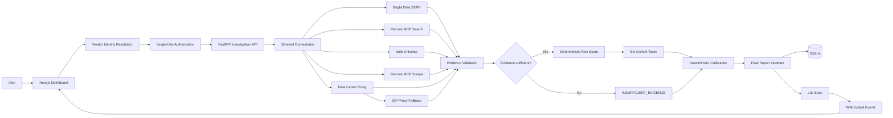
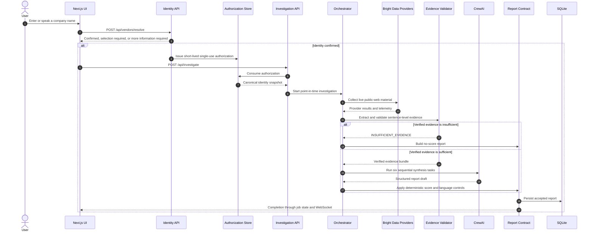
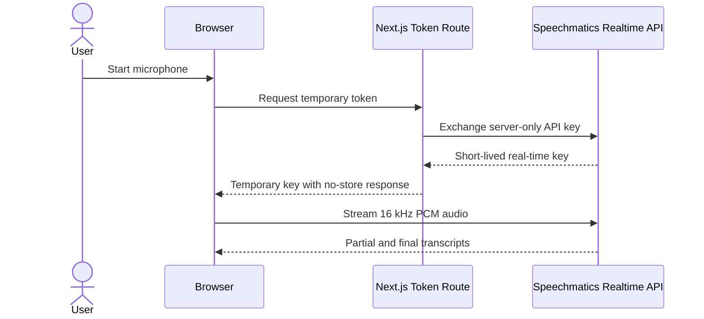
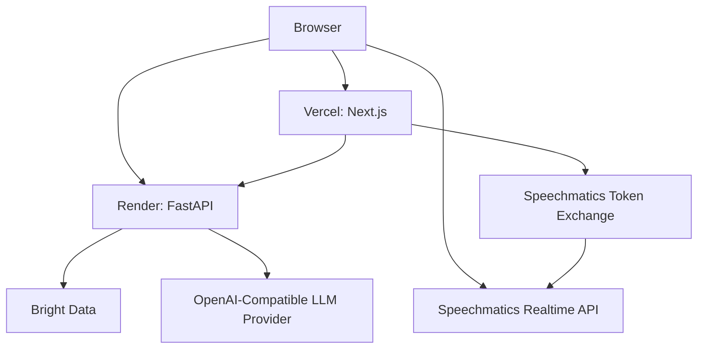

# System Architecture

[← Back to the project README](../README.md) ·
[Evidence Governance](./EVIDENCE_GOVERNANCE.md) ·
[Testing and Validation](./TESTING_AND_VALIDATION.md) ·
[Deployment and Operations](./DEPLOYMENT_AND_OPERATIONS.md)

---

## Purpose

This document describes the implemented and tested architecture of **Sentinel Web-Risk Intelligence** on the truth-hardening branch.

The system performs **point-in-time public-web vendor investigations**. It is not a continuous-monitoring service.

The architecture is designed around four requirements:

1. confirm the company before risk analysis;
2. preserve evidence boundaries and provenance;
3. keep score authority in deterministic code;
4. return an explicit no-score outcome when evidence is insufficient.

> **Architecture rule:** identity precedes investigation, verified evidence precedes synthesis, and deterministic validation precedes report acceptance.

---

## System context



---

## Design principles

| Principle | Architectural consequence |
|---|---|
| **Identity before risk** | A risk job cannot begin until the company identity is confirmed |
| **Evidence before synthesis** | CrewAI receives accepted, source-linked evidence rather than one raw text pool |
| **No-score is valid** | Insufficient evidence produces `INSUFFICIENT_EVIDENCE`, not a fabricated low-risk conclusion |
| **Deterministic authority** | Code owns score, level, trajectory, citations, and final report acceptance |
| **Auditable boundaries** | Retrieval, extraction, verification, scoring, and citation are recorded separately |
| **Provider isolation** | Optional provider failures do not automatically terminate the investigation |
| **Server-side secrets** | Long-lived Speechmatics and provider credentials never enter browser-visible variables |
| **Point-in-time scope** | The current implementation does not claim continuous surveillance |

---

## End-to-end request lifecycle



---

## Frontend layer

### Dashboard

`frontend/src/app/page.tsx` coordinates:

- typed vendor input;
- Speechmatics transcript input;
- identity resolution;
- additional identity context;
- candidate selection;
- authorized investigation creation;
- polling and WebSocket progress;
- report, history, and dashboard presentation.

### Identity panel

`VendorIdentityPanel.tsx` presents:

- confirmed identity details;
- candidate selection;
- website, country, city, and industry inputs;
- an explicit warning that scoring does not begin until identity is strongly confirmed.

### API client

`frontend/src/lib/api.ts` provides typed calls for:

- `resolveVendorIdentity`;
- `startInvestigation`;
- `getJobStatus`;
- `getRecentReports`;
- `getDashboardStats`;
- `createJobWebSocket`.

The client sends `identity_authorization_id` to the investigation endpoint.

### Speechmatics boundary

The long-lived Speechmatics key remains server-side.



The user reviews the final transcript before continuing to identity resolution.

---

## API and trust boundaries

### Vendor resolution

```http
POST /api/vendors/resolve
```

This endpoint:

- performs pre-investigation identity search;
- returns `CONFIRMED`, `SELECTION_REQUIRED`, or `MORE_INFORMATION_REQUIRED`;
- records accepted, rejected, and directory-lead identity evidence;
- does not create a risk job;
- does not start scoring;
- does not run CrewAI;
- does not write a report.

### Investigation authorization

An authorization may be issued when:

- resolution status is `CONFIRMED`;
- identity confidence is at least `0.90`;
- the selected identity has an authenticated source category;
- a canonical company name is available.

| Property | Behaviour |
|---|---|
| Default lifetime | 15 minutes |
| Allowed lifetime | 30–3600 seconds |
| Use count | Single use |
| Binding | Requested and canonical vendor identity |
| Public exposure | Excluded from job and report payloads |
| Storage | Process-local in the current prototype |

### Investigation creation

```http
POST /api/investigate
```

The API:

1. validates the vendor and language;
2. consumes the authorization;
3. replaces user-entered text with the canonical identity;
4. creates in-memory job state;
5. schedules the investigation;
6. streams progress over WebSocket;
7. persists the accepted report to SQLite.

---

## Provider orchestration

### Core provider

Bright Data SERP is the core live-search path used by the controlled live workflow.

### Supplementary providers

The orchestrator can use:

- Remote MCP `search_engine`;
- Web Unlocker;
- Remote MCP `scrape_as_markdown`;
- Data Center proxy;
- ISP proxy fallback.

Supplementary results are normalized and deduplicated by URL. Optional-provider failure is isolated and recorded.

### Current timeout boundaries

| Operation | Timeout |
|---|---:|
| SERP collection | 120 seconds |
| Remote MCP search | 90 seconds |
| Web Unlocker | 90 seconds |
| Remote MCP scrape | 90 seconds |
| Proxy request | 60 seconds |
| CrewAI pipeline | 420 seconds |

### Real and mock execution

```env
EXECUTION_MODE=real
```

Uses configured external providers.

```env
EXECUTION_MODE=mock
```

Uses deterministic local providers and avoids external Bright Data or proxy requests.

---

## Evidence and scoring layer

### Source boundaries

Retrieved results are converted into separate source documents. The system does not flatten all retrieved material into one untraceable scoring input.

### Candidate extraction

The validator evaluates sentence-level candidates across five categories:

- Financial
- Operational
- Legal
- Reputational
- Cybersecurity

### Rejection controls

A candidate can be rejected for:

- missing company or entity match;
- negated claim;
- hypothetical or speculative language;
- protective, preventive, guidance, monitoring, or resilience context;
- social-only evidence;
- weak direct attribution for high or critical severity;
- insufficient authority or independent corroboration.

### Score authority

The deterministic scorer:

- uses only verified records;
- applies severity base weights;
- applies source-quality and freshness multipliers;
- applies corroboration adjustment;
- suppresses duplicate category/indicator copies;
- derives score bands deterministically.

### Evidence sufficiency

The system returns `INSUFFICIENT_EVIDENCE` when:

- no verified evidence exists; or
- accepted evidence lacks the required authority, coverage, or corroboration.

This outcome:

- exposes no defensible numeric score;
- skips CrewAI;
- does not cite rejected material;
- explains the evidence gap.

---

## CrewAI boundary

When evidence is sufficient, six sequential roles support synthesis:

| Role | Responsibility |
|---|---|
| Recon | Review accepted live-search evidence |
| Scraping | Review accepted supplementary evidence |
| Verification | Assess credibility, recency, relevance, and contradictions |
| Intelligence | Synthesize the cross-category profile |
| Prediction | Draft a disruption estimate and time horizon |
| Reporting | Produce a structured executive JSON draft |

CrewAI does not own the authoritative score. Its output is calibrated and validated before acceptance.

---

## Report calibration and contract

The final contract validates:

- completed application status;
- evidence outcome and score availability;
- score and level alignment;
- confidence and disruption range;
- primary category;
- trajectory calibration;
- low-risk language inflation;
- point-in-time wording;
- citation validity and uniqueness;
- verified MCP citation requirements;
- evidence provenance;
- source/provider traceability;
- credential-marker absence;
- no-score rules for `INSUFFICIENT_EVIDENCE`.

> A report is not accepted merely because CrewAI returned valid JSON.

---

## State and storage

### Process-local state

The current backend keeps these items in memory:

- active jobs;
- WebSocket connections;
- investigation authorization records.

This state is not shared across multiple backend replicas.

### SQLite

SQLite stores accepted reports for:

- investigation history;
- report retrieval;
- report deletion;
- dashboard aggregates.

### Chroma configuration

The repository retains configurable Chroma persistence settings, but the validated investigation path does not use ChromaDB as the authority for final scoring.

---

## Hosted topology



Production CORS must explicitly include every Vercel origin allowed to call the Render backend.

---

## Scaling considerations

Before horizontal production scaling:

- move authorization records to Redis or another shared TTL store;
- move active jobs to a durable queue and shared state store;
- migrate report persistence to a production database;
- add authentication and role-based access control;
- add rate limiting and abuse prevention;
- add durable audit and event storage;
- implement provider budgets and quota controls;
- expose no-score outcomes consistently in every client;
- refine source authority beyond domain-suffix rules;
- add structured observability without leaking credentials.

---

## Related documentation

- [Evidence Governance](./EVIDENCE_GOVERNANCE.md)
- [Testing and Validation](./TESTING_AND_VALIDATION.md)
- [Deployment and Operations](./DEPLOYMENT_AND_OPERATIONS.md)
