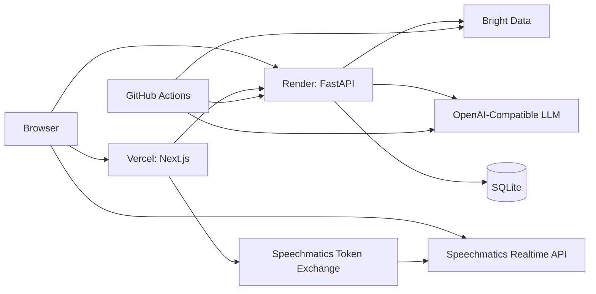
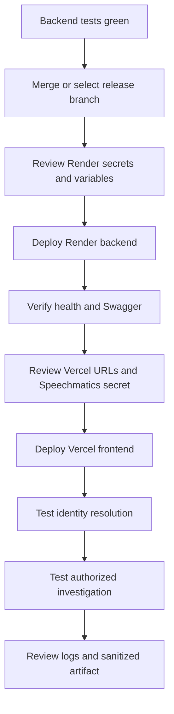

# Deployment and Operations

[← Back to the project README](../README.md) ·
[System Architecture](./ARCHITECTURE.md) ·
[Evidence Governance](./EVIDENCE_GOVERNANCE.md) ·
[Testing and Validation](./TESTING_AND_VALIDATION.md)

---

## Deployment model

The hosted prototype uses:

| Component | Platform |
|---|---|
| Frontend and Speechmatics token route | Vercel |
| FastAPI backend | Render |
| CI and controlled provider validation | GitHub Actions |
| Live-web services | Bright Data |
| Real-time transcription | Speechmatics |
| LLM transport | OpenAI-compatible endpoint |
| Report persistence | SQLite |



---

## Secret placement

| Secret or value | GitHub | Render | Vercel | Browser |
|---|:---:|:---:|:---:|:---:|
| `OPENAI_API_KEY` | Secret | Secret | No | Never |
| `BRIGHT_DATA_API_KEY` | Secret | Secret | No | Never |
| `BRIGHT_DATA_PROXY_USER` | Secret | Secret | No | Never |
| `BRIGHT_DATA_PROXY_PASS` | Secret | Secret | No | Never |
| `BRIGHT_DATA_ISP_PROXY_USER` | Secret | Secret | No | Never |
| `BRIGHT_DATA_ISP_PROXY_PASS` | Secret | Secret | No | Never |
| `SPEECHMATICS_API_KEY` | Optional secret | No | Server-only secret | Never |
| `SECRET_KEY` | Secret when CI requires it | Secret | No | Never |
| `NEXT_PUBLIC_API_URL` | Variable | No | Public variable | Yes |
| `NEXT_PUBLIC_WS_URL` | Variable | No | Public variable | Yes |

> Never prefix a provider credential with `NEXT_PUBLIC_`.

---

## Backend environment

### Application

```env
APP_ENV=production
APP_HOST=0.0.0.0
APP_PORT=8000
CORS_ORIGINS=https://sentinel-web-risk-intelligence.vercel.app
EXECUTION_MODE=real

SECRET_KEY=generate-a-strong-random-value
DATABASE_URL=sqlite:///./sentinel.db
```

For multiple allowed origins, use comma-separated values:

```env
CORS_ORIGINS=https://sentinel-web-risk-intelligence.vercel.app,https://required-preview-domain.vercel.app
```

Do not add trailing slashes to normal browser origins.

### LLM provider

```env
OPENAI_API_KEY=
OPENAI_BASE_URL=https://api.aimlapi.com/v1
FREE_TIER_MODEL=meta-llama/Llama-3.3-70B-Instruct-Turbo
```

### Bright Data core

```env
BRIGHT_DATA_API_KEY=
BRIGHT_DATA_SERP_ZONE=
BRIGHT_DATA_SERP_API_URL=https://api.brightdata.com/request
```

### Bright Data supplementary paths

```env
BRIGHT_DATA_WEB_UNLOCKER_ZONE=
BRIGHT_DATA_WEB_UNLOCKER_URL=https://api.brightdata.com/request

BRIGHT_DATA_MCP_BASE_URL=https://mcp.brightdata.com/mcp
BRIGHT_DATA_MCP_TOOLS=search_engine,scrape_as_markdown
BRIGHT_DATA_MCP_GROUPS=
BRIGHT_DATA_MCP_UNLOCKER_ZONE=
BRIGHT_DATA_MCP_PRO=false

BRIGHT_DATA_PROXY_HOST=brd.superproxy.io
BRIGHT_DATA_PROXY_PORT=
BRIGHT_DATA_PROXY_USER=
BRIGHT_DATA_PROXY_PASS=

BRIGHT_DATA_ISP_PROXY_USER=
BRIGHT_DATA_ISP_PROXY_PASS=

BRIGHT_DATA_ZONE=data_center
DATA_CENTER_PROXY=
ISP_PROXY=
```

Use either structured host, port, username, and password variables or complete proxy URLs according to the deployed configuration. Keep every related value synchronized when a zone, password, or port changes.

---

## Frontend environment

```env
NEXT_PUBLIC_API_URL=https://sentinel-web-risk-intelligence.onrender.com
NEXT_PUBLIC_WS_URL=wss://sentinel-web-risk-intelligence.onrender.com

# Server-only in the Vercel project.
SPEECHMATICS_API_KEY=
```

`SPEECHMATICS_API_KEY` is read by the Next.js server route and exchanged for a short-lived real-time key.

---

## Render backend deployment

### Recommended service configuration

| Render setting | Value |
|---|---|
| Service type | Web Service |
| Repository | `Jxxy123/sentinel-web-risk-intelligence` |
| Root directory | `backend` |
| Runtime | Python 3 |
| Build command | `pip install -r requirements.txt` |
| Start command | `python main.py` |
| Branch | Release branch, or `main` after merge |

### Deployment steps

1. Open the Render service.
2. Confirm the intended Git branch.
3. Open **Environment**.
4. Add or update the required variables.
5. Choose **Save, rebuild, and deploy**.
6. Wait for the deployment to become live.
7. Open the health endpoint.
8. Open Swagger UI.
9. Review logs for provider configuration errors.

### Backend verification

```text
https://sentinel-web-risk-intelligence.onrender.com/health
https://sentinel-web-risk-intelligence.onrender.com/docs
```

The Render free tier may sleep after inactivity. The first request can therefore take longer than subsequent requests.

---

## Vercel frontend deployment

### Required project variables

```env
NEXT_PUBLIC_API_URL=https://sentinel-web-risk-intelligence.onrender.com
NEXT_PUBLIC_WS_URL=wss://sentinel-web-risk-intelligence.onrender.com
SPEECHMATICS_API_KEY=
```

Apply the variables to the environments that need them:

- Production
- Preview
- Development, when Vercel-hosted development deployments are used

### Deployment steps

1. Open the Vercel project.
2. Open **Environment Variables**.
3. Add or update the variables.
4. Open **Deployments**.
5. Select the intended deployment.
6. Choose **Redeploy**.
7. Select the correct environment.
8. Leave build cache disabled when verifying configuration changes.
9. Wait for the deployment to become ready.
10. Open the deployment URL and test the identity-first flow.

---

## GitHub Actions configuration

### Secrets

Store credentials under:

```text
Settings → Secrets and variables → Actions → Secrets
```

Typical secrets include:

```text
OPENAI_API_KEY
BRIGHT_DATA_API_KEY
BRIGHT_DATA_PROXY_USER
BRIGHT_DATA_PROXY_PASS
BRIGHT_DATA_ISP_PROXY_USER
BRIGHT_DATA_ISP_PROXY_PASS
SECRET_KEY
```

Add `SPEECHMATICS_API_KEY` only to workflows that explicitly test Speechmatics.

### Variables

Store non-secret configuration under:

```text
Settings → Secrets and variables → Actions → Variables
```

Typical variables include:

```text
OPENAI_BASE_URL
FREE_TIER_MODEL
BRIGHT_DATA_SERP_ZONE
BRIGHT_DATA_SERP_API_URL
BRIGHT_DATA_MCP_BASE_URL
BRIGHT_DATA_MCP_TOOLS
BRIGHT_DATA_MCP_UNLOCKER_ZONE
BRIGHT_DATA_MCP_PRO
BRIGHT_DATA_WEB_UNLOCKER_ZONE
BRIGHT_DATA_WEB_UNLOCKER_URL
BRIGHT_DATA_PROXY_HOST
BRIGHT_DATA_PROXY_PORT
BRIGHT_DATA_ZONE
```

Do not copy a secret value into a variable merely to simplify workflow syntax.

---

## Recommended deployment sequence



---

## CORS configuration

Render must allow every browser origin that calls the API.

Example:

```env
CORS_ORIGINS=https://sentinel-web-risk-intelligence.vercel.app,https://sentinel-web-risk-intelligence-jaxp5dfej.vercel.app
```

Use exact origins:

- include the scheme;
- exclude paths;
- exclude normal trailing slashes;
- do not use placeholder domains;
- do not use `*` in production unless the security model explicitly allows it.

A CORS failure often appears in the browser as `Failed to fetch`, even when the backend is otherwise healthy.

---

## Operational verification

### Frontend

Confirm:

- the page loads;
- identity resolution requests additional context when appropriate;
- candidate selection works;
- Speechmatics token exchange succeeds;
- partial and final transcripts appear;
- investigation starts only after identity confirmation;
- WebSocket progress updates appear;
- the report handles scored and no-score outcomes.

### Backend

Confirm:

- `/health` returns successfully;
- `/docs` loads;
- `/api/vendors/resolve` is available;
- `/api/investigate` requires authorization;
- replayed authorization is rejected;
- logs show provider telemetry without credentials;
- accepted reports pass the final contract.

### Controlled workflow

Run a paid controlled live workflow only when provider, orchestration, or contract changes require end-to-end validation.

---

## Logs and artifacts

A controlled live workflow writes:

```text
artifacts/controlled_live_investigation.json
```

The workflow should upload a sanitized artifact even when a post-run contract check fails.

Review artifacts for:

- canonical identity;
- evidence outcome;
- verified and rejected counts;
- source URLs and excerpts;
- score availability;
- provider telemetry;
- provenance;
- credential absence.

Never upload raw `.env` files or authenticated provider URLs.

---

## Credential rotation

When rotating a provider credential:

1. generate the new credential;
2. update the required GitHub secret;
3. update Render when the backend uses it;
4. update Vercel when the server-side frontend route uses it;
5. update linked usernames, zones, ports, or endpoints;
6. rebuild the affected deployments;
7. run a focused smoke test;
8. revoke the old credential.

Do not regenerate unrelated credentials.

---

## Troubleshooting

### Frontend shows `Failed to fetch`

Check:

- `NEXT_PUBLIC_API_URL`;
- Render service availability;
- Render logs;
- exact `CORS_ORIGINS`;
- HTTPS versus HTTP;
- Vercel environment assignment;
- whether the frontend was redeployed after variable changes.

### Backend returns `404 Not Found`

Check:

- the frontend is calling the Render backend, not the Vercel domain;
- the current backend branch includes the endpoint;
- Render deployed the expected commit;
- the request path matches Swagger.

### Speechmatics is unavailable

Check:

- `SPEECHMATICS_API_KEY` exists in Vercel;
- the variable is server-only;
- the deployment was rebuilt;
- microphone permission;
- same-origin token request;
- Speechmatics account and credits.

### SERP timeout

One query timeout can be isolated while other queries continue. Review the complete run before treating one timeout as a full-system failure.

### Web Unlocker error body

The client rejects unusable provider error bodies. The orchestrator may continue through MCP scrape or proxy fallback.

### Proxy `403`

Check:

- zone username;
- current password;
- product access;
- current proxy port;
- ISP-specific credentials for ISP usage;
- Render outbound connectivity.

An optional proxy `403` does not necessarily invalidate the final report when verified evidence is available elsewhere.

### Workflow fails after artifact creation

The investigation completed, but a post-run validator rejected the report.

Search the logs for:

```text
Calibrated report contract failed
```

Download and inspect the artifact before starting another paid run. Add a focused regression test before rerunning the complete workflow.

---

## Persistence and scaling

Current caveats:

- SQLite on ephemeral storage may not survive every deployment lifecycle event without a persistent disk;
- in-memory job state is lost on restart;
- in-memory authorization state is lost on restart;
- multiple backend replicas do not share jobs or authorizations;
- free-tier sleep can delay the first request.

A production architecture should use:

- PostgreSQL;
- Redis;
- a durable task queue;
- a shared authorization TTL store;
- object storage for sanitized artifacts;
- structured observability;
- authentication;
- rate limiting.

---

## Security checklist

- [ ] No `.env` or `.env.local` file committed
- [ ] No provider secret in a frontend public variable
- [ ] No authenticated MCP URL logged
- [ ] No identity authorization token in reports or jobs
- [ ] CORS restricted to intended browser origins
- [ ] `SECRET_KEY` rotated from defaults
- [ ] GitHub Actions permissions kept minimal
- [ ] Artifacts sanitized and retained only as required
- [ ] Provider failures do not reveal credentials
- [ ] Report-contract credential-marker checks enabled
- [ ] Required pull-request checks are green
