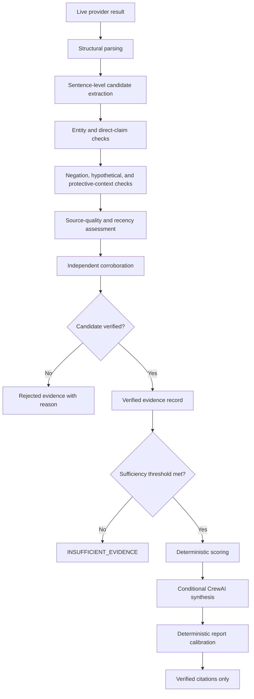

# Evidence Governance

[← Back to the project README](../README.md) ·
[System Architecture](./ARCHITECTURE.md) ·
[Testing and Validation](./TESTING_AND_VALIDATION.md) ·
[Deployment and Operations](./DEPLOYMENT_AND_OPERATIONS.md)

---

## Purpose

Sentinel Web-Risk Intelligence uses public-web material to support a **point-in-time vendor-risk assessment**.

This document defines how the system governs:

- company identity;
- evidence extraction and rejection;
- source quality;
- score authority;
- LLM use;
- citations and provenance;
- uncertainty;
- no-score outcomes;
- human oversight.

> The goal is not to claim perfect truth. The goal is to make evidence boundaries, rejection decisions, and uncertainty explicit and auditable.

---

## Governance principles

| Principle | Rule |
|---|---|
| **Confirm identity first** | No risk analysis begins until the company is strongly resolved |
| **Preserve evidence boundaries** | Exact excerpts, source URLs, and provider labels remain attached to claims |
| **Reject rather than infer** | Weak attribution is not repaired with LLM speculation |
| **Do not reward missing data** | Missing evidence is not treated as low risk |
| **Scale proof with severity** | Higher-severity claims require stronger authority or corroboration |
| **Keep deterministic authority** | Code owns score, level, trajectory, citations, and report acceptance |
| **Cite accepted evidence only** | Retrieval alone does not justify citation |
| **Record rejection reasons** | Rejected claims remain auditable |
| **Expose uncertainty** | `INSUFFICIENT_EVIDENCE` is a valid result |
| **Require human review** | Consequential decisions must not rely on the score alone |

---

## Evidence decision lifecycle



---

## Identity governance

### Identity inputs

The resolver can use:

- requested vendor name;
- official website;
- country;
- city;
- industry;
- candidate legal name;
- source-quality labels;
- evidence URLs.

### Identity outcomes

| Outcome | Consequence |
|---|---|
| `CONFIRMED` | A short-lived investigation authorization may be issued |
| `SELECTION_REQUIRED` | The user must select or refine a candidate |
| `MORE_INFORMATION_REQUIRED` | The user must provide additional identity context |

### Confirmation threshold

Investigation authorization requires:

- identity confidence of at least `0.90`;
- an authenticated identity source category;
- a selected candidate;
- a canonical company name.

### Authorization governance

The authorization is:

- opaque;
- short-lived;
- single-use;
- bound to the requested and canonical company names;
- removed from the public identity snapshot;
- excluded from reports and job payloads.

**Current limitation:** authorization state is process-local.

---

## Evidence record model

| Field | Purpose |
|---|---|
| `company` | Canonical target company |
| `category` | Financial, Operational, Legal, Reputational, or Cybersecurity |
| `severity` | Critical, High, Medium, or Low |
| `indicator` | Trigger phrase under evaluation |
| `source_url` | Exact source origin |
| `source_title` | Human-readable source title |
| `source_provider` | Retrieval provider |
| `source_quality` | Rule-based quality class |
| `publication_date` | Recency input when available |
| `evidence_excerpt` | Exact sentence used for validation |
| `entity_match` | Whether the target company is linked |
| `direct_claim` | Whether the event is directly attributed |
| `negated` | Whether the claim is denied or negated |
| `hypothetical` | Whether the statement is speculative |
| `protective_context` | Whether the phrase appears in prevention or guidance context |
| `corroboration_count` | Number of credible independent supporting domains |
| `independent_domains` | Supporting domains |
| `verified` | Final acceptance flag |
| `rejection_reason` | Auditable explanation |

---

## Source-quality classes

| Class | Intended meaning |
|---|---|
| `AUTHORITATIVE` | Government, regulator, authority, or comparable official-domain rule |
| `COMPANY_OWNED` | Official domain of the confirmed company |
| `REPUTABLE_NEWS` | Explicitly allow-listed major newsroom |
| `SPECIALIST` | Domain-specific professional or technical publisher |
| `GENERAL_WEB` | Other public web source |
| `SOCIAL` | Social or community source; lead-only |
| `UNKNOWN` | Unclassified or missing domain |

> **Important limitation:** a government-domain suffix can indicate an official host, but it does not prove that every page on that host is authoritative for the target company or event.

Recommended future improvements:

- official-source allow-lists by jurisdiction and subject;
- company-domain validation against confirmed identity;
- publication and editorial metadata;
- event-specific source preference;
- canonical URL and content-origin checks;
- unique authoritative-domain counting.

---

## False-attribution controls

### Entity match

The target company must appear in the sentence or relevant context, or be supported by the confirmed official company domain.

### Negation

Local patterns such as `no`, `not`, `never`, `denied`, `false`, or `unfounded` can reject a candidate.

### Hypothetical language

Patterns such as `may`, `might`, `could`, `possible`, `scenario`, and `risk of` can mark a candidate as speculative.

### Protective context

Prevention and guidance language must not become an incident.

> “Microsoft Defender prevented a ransomware attack.”

must not become:

> “Microsoft suffered a ransomware attack.”

Protective patterns include terms such as:

- prevented;
- protected against;
- guidance;
- preparedness;
- resilience;
- monitoring.

### Direct claim

High- and critical-severity evidence must directly attribute the event to the company. Merely mentioning the company and an indicator on the same page is insufficient.

### Corroboration

Higher-severity evidence requires stronger authority or multiple credible independent domains.

---

## Evidence sufficiency

A score requires verified evidence and at least one implemented sufficiency path:

- multiple unique verified domains;
- at least one authoritative record;
- sufficiently corroborated company-owned evidence.

When sufficiency is not met, the report status is:

```text
INSUFFICIENT_EVIDENCE
```

### No-score rule

Absence of public evidence does not mean absence of risk.

For `INSUFFICIENT_EVIDENCE`:

- `risk_score_available` is `false`;
- CrewAI synthesis is skipped;
- final citations are empty;
- rejected candidates remain in the audit trail;
- final language states that no defensible score was assigned.

Compatibility placeholders must not be interpreted as real risk values.

---

## Deterministic scoring

### Severity base weights

| Severity | Base weight |
|---|---:|
| Critical | 35 |
| High | 20 |
| Medium | 10 |
| Low | 3 |

### Source multipliers

| Source quality | Multiplier |
|---|---:|
| Authoritative | 1.00 |
| Reputable news | 0.95 |
| Company-owned | 0.85 |
| Specialist | 0.75 |
| General web | 0.55 |
| Unknown | 0.35 |
| Social | 0.00 |

### Freshness multipliers

| Publication age | Multiplier |
|---|---:|
| Up to 90 days | 1.00 |
| Up to 365 days | 0.90 |
| Up to 730 days | 0.70 |
| Older than 730 days | 0.45 |
| Unknown date | 0.75 |

### Corroboration and duplicate suppression

Corroboration can increase a weighted contribution, subject to a cap.

Only the strongest weighted record for a category and indicator pair contributes fully to the numeric score.

---

## Confidence

Confidence is derived from:

- confirmed identity confidence;
- unique-source coverage;
- proportion of high-quality evidence;
- proportion of corroborated evidence.

Confidence is **not** the probability that every statement is true. It is a structured indication of evidence coverage and quality under the implemented rules.

---

## LLM governance

### The LLM may

- summarize accepted evidence;
- identify contradictions;
- organize a cross-category narrative;
- draft recommendations;
- produce a structured JSON report candidate.

### The LLM may not

- create the authoritative numeric score;
- promote rejected evidence;
- cite a provider merely because it returned a result;
- convert missing evidence into low risk;
- claim continuous monitoring;
- contradict deterministic score thresholds;
- expose provider credentials;
- invent an incident when accepted evidence is absent.

### Conditional execution

The six-agent CrewAI pipeline runs only when:

```text
risk_score_available == true
```

---

## Report outcomes

### Scored report

A scored report must:

- have a valid score and matching level;
- contain at least one verified citation;
- use a calibrated trajectory and category;
- record deterministic scoring authority;
- include provider traceability;
- pass credential-marker checks.

### Insufficient-evidence report

A no-score report must:

- mark score availability as false;
- contain zero verified sources;
- contain zero verified evidence records;
- skip AI synthesis;
- use explicit no-score wording;
- avoid a disruption estimate;
- retain rejected evidence for audit.

---

## Evidence provenance

Provenance can record:

- provider;
- retrieval status;
- URL;
- retrieval timestamp;
- character count;
- SHA-256 content digest.

Raw scraped content is excluded from provenance records.

A successful MCP scrape reported as used must have matching successful provenance.

---

## Retrieval is not acceptance

| Stage | Meaning |
|---|---|
| Provider returned a result | Retrieval succeeded |
| Result passed parsing | Result is structurally usable |
| Candidate was extracted | A risk phrase was detected |
| Candidate was verified | The claim passed governance controls |
| Source was cited | Verified evidence reached the final report |

A result must not be cited solely because it was retrieved.

---

## Human oversight

Before consequential action, a reviewer should inspect:

- canonical company identity;
- exact evidence excerpt;
- source relevance and publication date;
- whether the source is authoritative for the specific event;
- independent corroboration;
- rejected evidence;
- score availability;
- confidence and coverage message;
- recommended actions.

---

## Known governance gaps

- Rule-based authority classification can overvalue irrelevant government-domain pages.
- Authoritative count currently relates to verified evidence records and needs review for unique-source semantics.
- Publication dates are unavailable for some results.
- Public-web evidence can omit private operational or financial information.
- Every client must explicitly support no-score outcomes.
- Human approval is not yet enforced in code.
- There is no signed evidence ledger or immutable audit store.
- Authorization storage is not distributed.

---

## Safe project description

Recommended:

> Sentinel is an identity-first, evidence-grounded, point-in-time vendor-risk intelligence prototype with deterministic calibration and explicit insufficient-evidence handling.

Avoid unsupported claims such as:

- “truth-proof”;
- “guaranteed prediction”;
- “continuous monitoring” unless a scheduler is deployed;
- “fully autonomous” without identity-confirmation context;
- “all web data”;
- “zero hallucinations”;
- “enterprise ready” without qualification.
