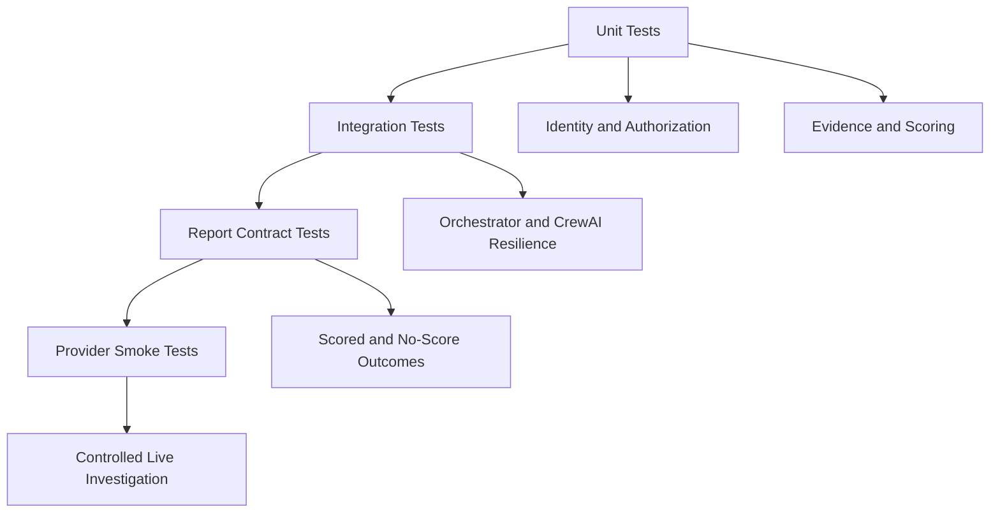

# Testing and Validation

[← Back to the project README](../README.md) ·
[System Architecture](./ARCHITECTURE.md) ·
[Evidence Governance](./EVIDENCE_GOVERNANCE.md) ·
[Deployment and Operations](./DEPLOYMENT_AND_OPERATIONS.md)

---

## Objective

Sentinel testing verifies more than whether a Python function returns a value.

The strategy covers:

- identity ambiguity;
- authorization security;
- provider normalization and fallback behaviour;
- false attribution;
- evidence sufficiency;
- deterministic scoring;
- CrewAI resilience;
- report calibration;
- valid no-score outcomes;
- controlled real-provider execution.

---

## Current validation status

Validated on **31 July 2026** on `fix/truth-telemetry-hardening`.

### Backend CI summary

| Measure | Result |
|---|---|
| Tests | **216 passed** |
| Failures | **0** |
| Warnings | 8 non-blocking deprecation warnings |
| Measured coverage | 100% for `core/risk_engine.py` |
| Enforced threshold | 90% for the measured module |
| Critical lint checks | Ruff `E9`, `F63`, `F7`, `F82` |
| Security scan | Bandit medium/high-confidence rules |

> The 100% coverage figure applies to `core/risk_engine.py`, not to every backend module.

### Final controlled live investigation

| Field | Result |
|---|---|
| Target vendor | Microsoft |
| Workflow | Controlled Full Live Investigation |
| Application status | `completed` |
| Evidence outcome | `COMPLETED` |
| Score availability | `true` |
| Risk result | 4/100 (`LOW`) |
| Confidence | 0.46 |
| Disruption probability | 0.05 |
| Unique search results | 29 |
| Verified cited sources | 1 |
| Usable provider outputs | SERP API, Remote MCP `search_engine`, Remote MCP `scrape_as_markdown` |
| Optional providers without usable output | Proxy Network, Web Unlocker |
| Request duration | 232.82 seconds |
| Database writes | 0 |
| Workflow result | Passed |

This run validates the engineering pipeline. It is not a benchmark of universal company coverage or future-event prediction accuracy.

---

## Test strategy



---

## Test layers

### Unit tests

Representative checks include:

- company-name normalization;
- website and domain normalization;
- score thresholds;
- source-quality multipliers;
- freshness rules;
- report-calibration helpers;
- SERP parsing;
- duplicate URL removal.

### Identity tests

Relevant suites include:

```text
test_company_identity.py
test_live_vendor_identity.py
test_vendor_resolution.py
test_vendor_resolution_api.py
test_vendor_identity_runtime_smoke_test.py
```

They verify:

- generic and ambiguous names;
- candidate construction;
- accepted and rejected identity evidence;
- identity outcome states;
- user-provided context;
- absence of LLM and risk scoring during identity resolution.

### Authorization tests

Relevant suites include:

```text
test_investigation_authorization.py
test_confirmed_investigation_gate.py
test_confirmed_orchestrator_context.py
```

They verify:

- authorization only for confirmed identities;
- confidence threshold;
- authenticated identity-source requirement;
- expiration;
- single-use semantics;
- replay rejection;
- vendor mismatch rejection;
- authorization exclusion from jobs and reports.

### Evidence tests

Relevant suites include:

```text
test_evidence_validation.py
test_evidence_scoring.py
test_truth_hardening_regression.py
```

They verify:

- entity match;
- negation;
- hypothetical language;
- protective context;
- source quality;
- corroboration;
- duplicate suppression;
- `INSUFFICIENT_EVIDENCE`;
- prevention language does not become an incident.

### Provider tests

Provider-focused tests and workflows cover:

- shared Bright Data request client;
- SERP parsing;
- Web Unlocker response validation;
- Data Center proxy;
- ISP proxy;
- Remote MCP connection;
- MCP search normalization;
- wrapped MCP payloads;
- MCP scrape;
- provider failure isolation;
- mock versus real provider selection.

### Orchestration tests

Relevant suites include:

```text
test_crewai_structure.py
test_crewai_resilience.py
test_orchestrator_integration.py
```

They verify:

- exactly six agent and task roles;
- sequential task relationships;
- retry handling;
- timeout and error fallback;
- provider telemetry;
- the verified-evidence boundary;
- CrewAI skip for insufficient evidence;
- report completion despite optional-provider failure.

### Report tests

Relevant suites include:

```text
test_report_calibration.py
test_report_contract.py
test_report_outcomes.py
```

They verify:

- score and level consistency;
- primary category;
- calibrated trajectory;
- low-risk language controls;
- point-in-time wording;
- citation validity;
- MCP citations only for verified MCP evidence;
- provenance hashes;
- credential-marker rejection;
- scored and no-score report outcomes.

---

## Local validation

### Linux or macOS

```bash
cd backend

python -m venv .venv
source .venv/bin/activate

pip install -r requirements-dev.txt

ruff check . --select E9,F63,F7,F82

bandit -r core agents main.py \
  -ll \
  -ii \
  --skip B104

python -m pytest tests \
  -v \
  --cov=core.risk_engine \
  --cov-report=term-missing \
  --cov-fail-under=90
```

### Windows PowerShell

```powershell
cd backend

python -m venv .venv
.venv\Scripts\Activate.ps1

pip install -r requirements-dev.txt

ruff check . --select E9,F63,F7,F82

bandit -r core agents main.py `
  -ll `
  -ii `
  --skip B104

python -m pytest tests `
  -v `
  --cov=core.risk_engine `
  --cov-report=term-missing `
  --cov-fail-under=90
```

Expected condition:

```text
0 failed
coverage threshold reached
```

---

## GitHub Actions workflow classes

| Workflow class | Purpose | External cost risk |
|---|---|---|
| Backend unit tests | Deterministic backend regression suite | None |
| Identity smoke tests | Validate identity runtime and live resolution paths | Possible provider usage |
| Confirmed-investigation tests | Validate authorization and identity handoff | Possible provider usage |
| Bright Data smoke tests | Validate one provider path at a time | Provider credits |
| CrewAI live smoke test | Validate LLM orchestration | LLM and provider credits |
| Controlled full live investigation | Validate the full production-style path | Highest cost; run deliberately |

> Do not trigger controlled live workflows repeatedly when a deterministic unit or contract test can isolate the issue.

---

## Controlled live workflow acceptance

A live run can end in either valid report outcome.

### `COMPLETED`

Requirements:

- `risk_score_available` is `true`;
- a valid score and matching level are present;
- at least one verified source is cited;
- deterministic calibration succeeds;
- the report contract accepts the output.

### `INSUFFICIENT_EVIDENCE`

Requirements:

- `risk_score_available` is `false`;
- no rejected source is promoted into the final citations;
- verified evidence and verified-source counts are zero;
- CrewAI synthesis is skipped;
- no-score language is explicit;
- the report contract accepts the output.

---

## Artifact review checklist

Before accepting a controlled live artifact, inspect the following.

### Identity

- canonical company name;
- confirmed website and domain;
- country and industry;
- identity confidence;
- source quality;
- selected candidate.

### Evidence

- verified count;
- rejected count;
- exact excerpts;
- source quality;
- direct-claim flag;
- negation, hypothetical, and protective flags;
- corroborating domains;
- rejection reasons.

### Report

- score availability;
- score and level;
- confidence;
- disruption probability;
- key findings;
- citations;
- provider list;
- provenance;
- scoring authority;
- language authority;
- LLM execution status.

### Security

Confirm that the artifact contains no:

- API key;
- bearer token;
- proxy password;
- identity authorization ID;
- authenticated MCP URL;
- raw scraped content inside provenance.

---

## Deprecation warnings

The current green run contains eight non-blocking warnings, mainly from dependencies and FastAPI startup-event usage.

Planned maintenance:

- migrate FastAPI `on_event("startup")` to lifespan handlers;
- monitor Beautiful Soup and lxml deprecations;
- monitor dependency compatibility with Python 3.11 and future versions.

Warnings are maintenance items, not passing-test failures.

---

## Regression rules

Every future change must preserve these invariants:

1. identity resolution occurs before risk scoring;
2. authorization remains short-lived and single-use;
3. rejected evidence never changes the score;
4. protective context never becomes a vendor incident;
5. missing evidence never becomes low risk;
6. CrewAI is skipped for insufficient evidence;
7. scored reports contain verified citations;
8. no-score reports do not cite rejected evidence;
9. verified MCP evidence requires an MCP citation;
10. provider retrieval alone does not require citation;
11. deterministic score and language remain authoritative;
12. reports expose no protected credentials.

---

## Release acceptance criteria

Before merging into `main`:

- [ ] Backend CI is green
- [ ] Frontend build is green when frontend code changed
- [ ] Required branch-protection checks are green
- [ ] Controlled live validation is green when provider or orchestration code changed
- [ ] The report artifact has been manually reviewed
- [ ] README and documentation are current
- [ ] Deployment variables have been reviewed
- [ ] No secret files are committed
- [ ] Source-authority limitations are disclosed
- [ ] The pull request explains test evidence and residual risk
